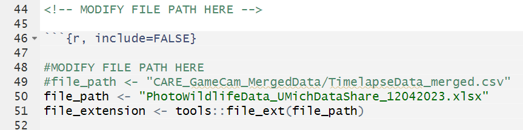

Capitol Reef National Park Project:
Authors: Abigail Finn, Brooke Rossow, Harrison Barth, Miles Scheffler

The following document contains directions and important information for using the animal_data_markdown.Rmd file for Timelapse analysis. 

ABOUT: The animal_data_markdown is a dynamic Rmd which summarizes trends from motion sensor cameras within Capitol Reef National park. The report was created using the "TimelapseDataMerged.CSV" and "PhotoWildlifeData_UMichDataShare_12042023.xlsx" files as example data. These are located within the Data folder of the CapitolReef Github project for reference. The specific metrics within this report come from Data/Metrics_CameraData_CapitolReefNP.xlsx. There are 4 different sections within the report:
1) Overview: Capitol Reef Camera Data
2) Bighorn Sheep Monitoring
    - Gender
    - Age
3) Number of Cameras
4) Percentage of Detection by Species
These are separated within the animal_data_markdown.Rmd file by dashed lines ------ and a new title for each section. 

SUGGESTIONS: The file is equipped to run multiple years of timelapse data into one report, however for readability, it is recommended that excel files contain a maximum of 6 years of data at a time. 

DIRECTIONS:
1) Necessary libraries: The first code from lines 14-42 downloads all necessary libraries associated with this project. If there are errors in from this section then a specific library may be missing locally. Run the below code with the missing library to update this:
    if (!require('library')) install.packages('library')
    library('library')

2) Modifying the file path: The following code block from lines 46-71 contains a "file_path" variable with the comment "MODIFY FILE PATH HERE". Alter the path of that variable to match the location of the file you want to run. The file you run should be downloaded locally.

FILE FORMATS: The files provided should match the formats and structure of the "TimelapseDataMerged.CSV" and/or "PhotoWildlifeData_UMichDataShare_12042023.xlsx" files provided within the "Data" folder of the repository. These files were used to create the report, so other formats will cause errors.

